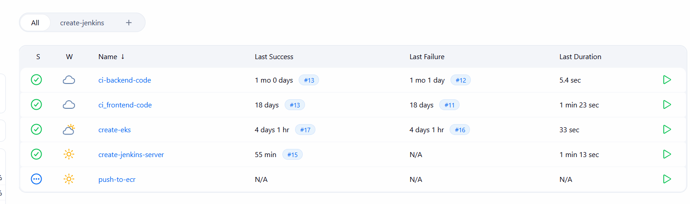
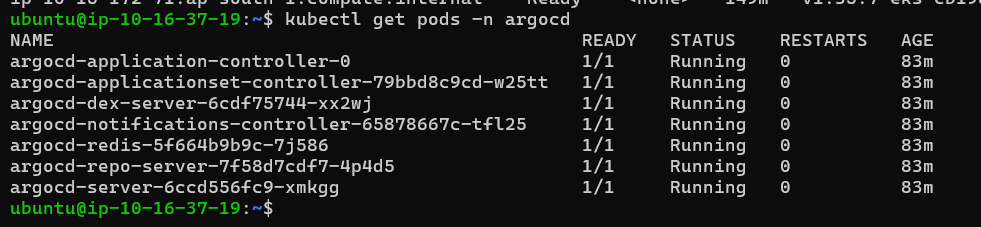
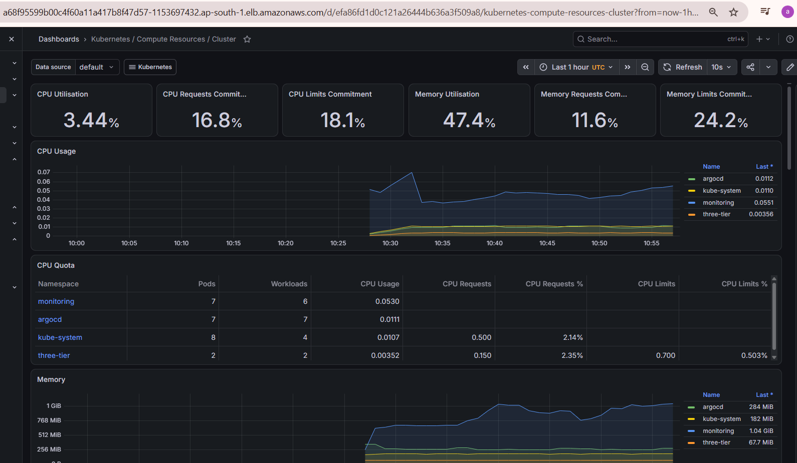

# Production-Style DevOps Platform on AWS

## Overview

This project demonstrates the design and implementation of a production-style DevOps platform on AWS using Infrastructure as Code (IaC), Kubernetes, CI/CD, GitOps, containerization, security scanning, and monitoring technologies.

The platform provisions an Amazon EKS cluster using Terraform, utilizes a dedicated Jenkins server for infrastructure provisioning and application delivery, implements GitOps deployments using ArgoCD, and provides observability through Prometheus and Grafana.

The objective of this project was to simulate a real-world DevOps environment by combining infrastructure automation, secure software delivery, Kubernetes operations, GitOps workflows, and monitoring into a single platform.

---

# Solution Architecture

```text
                               GitHub
                                  │
                                  │
                        Source Code & Manifests
                                  │
                                  ▼
                       +--------------------+
                       |   Jenkins Server   |
                       |       (EC2)        |
                       +--------------------+
                                  │

          ┌───────────────────────┼───────────────────────┐
          │                                               │

          ▼                                               ▼

 Infrastructure Pipeline                         Application CI Pipeline
      (Terraform)                                (Frontend / Backend)

          │                                               │

          ▼                                               ▼

 AWS Infrastructure                            SonarQube Analysis
                                                 Quality Gate Check
                                                   Security Scans
                                                     Docker Build
                                                  Push Image to ECR

          │                                               │

          ▼                                               ▼

   Amazon EKS Cluster                         Kubernetes Manifest Update

          │                                               │

          └───────────────────────┬───────────────────────┘
                                  │
                                  ▼

                               ArgoCD
                           (GitOps Engine)

                                  │
                                  ▼

                       Kubernetes Deployments

                                  │
                                  ▼

                      Prometheus & Grafana
                            Monitoring
```

---

# Project Snapshots

The following screenshots provide a quick overview of the platform components and deployment workflow.

## Jenkins Automation Platform

Jenkins acts as the central automation server for infrastructure provisioning, CI/CD execution, security scanning, and GitOps integration.



---

## Terraform-Provisioned AWS Infrastructure

Terraform provisions the AWS networking components and Amazon EKS cluster used throughout the platform.


---

## SonarQube Quality Gates

Code quality validation is enforced before container images are built and deployed.

### Backend Quality Gate


### Frontend Quality Gate


---

## ArgoCD GitOps Deployment

ArgoCD continuously synchronizes Kubernetes workloads with the desired state stored in Git repositories.



---

## Grafana Monitoring Dashboard

Grafana provides cluster, namespace, node, and workload observability using Prometheus metrics.



---

# Documentation Index

| Component | Documentation |
|------------|---------------|
| Amazon EKS Infrastructure | [eks-setup/README.md](./eks-setup/README.md) |
| Post Deployment Configuration | [eks-setup/post-deployment-configuration.md](./eks-setup/post-deployment-configuration.md) |
| Jenkins Server Infrastructure | [jenkins-server/README.md](./Jenkins-Server-TF/README.md) |
| CI/CD Pipelines | [ci-cd/README.md](./ci-cd/README.md) |
| ArgoCD GitOps | [argocd/README.md](./argocd/README.md) |
| Monitoring & Observability | [monitoring/README.md](./monitoring/README.md) |

---

# Technology Stack

## Cloud & Infrastructure

- AWS
- Amazon EKS
- Amazon EC2
- Amazon ECR
- VPC
- IAM
- OIDC / IRSA

## Infrastructure as Code

- Terraform

## Containers & Kubernetes

- Docker
- Kubernetes
- Helm
- AWS Load Balancer Controller

## CI/CD & Automation

- Jenkins
- GitHub
- SonarQube
- Trivy
- OWASP Dependency Check

## GitOps

- ArgoCD

## Monitoring & Observability

- Prometheus
- Grafana
- Alertmanager
- kube-prometheus-stack

---

# Project Components

## 1. Amazon EKS Infrastructure

Provisioned a complete Kubernetes platform using Terraform.

### Resources Created

- VPC
- Public Subnets
- Private Subnets
- Internet Gateway
- NAT Gateway
- Route Tables
- Security Groups
- Amazon EKS Cluster
- Managed Node Groups
- IAM Roles and Policies

### Features

- Multi-AZ deployment
- Public and private networking
- Managed Kubernetes control plane
- Spot and On-Demand worker nodes
- Infrastructure as Code approach

📄 **Documentation**

➡️ [Amazon EKS Infrastructure](./eks-setup/README.md)

---

## 2. Post-Deployment Cluster Configuration

After EKS provisioning, additional Kubernetes and AWS integrations were configured to make the cluster operational for production-style workloads.

### Components Configured

- IAM OIDC Provider
- IAM Roles for Service Accounts (IRSA)
- AWS Load Balancer Controller
- Public ALB Integration
- ArgoCD Installation
- Amazon ECR Authentication
- Namespace Organization
- Prometheus & Grafana Installation

📄 **Documentation**

➡️ [Post Deployment Configuration](./eks-setup/post-deployment-configuration.md)

---

## 3. Jenkins Server Infrastructure

A dedicated Amazon EC2 instance was configured as the central automation platform for the project.

### Responsibilities

#### Infrastructure Automation

- Terraform execution
- EKS provisioning
- Infrastructure lifecycle management

#### Application Delivery

- CI/CD orchestration
- SonarQube integration
- Security scanning
- Docker image builds
- Amazon ECR integration
- GitOps manifest updates

### Installed Components

- Jenkins
- SonarQube
- Docker
- AWS CLI
- Terraform
- kubectl
- eksctl
- Helm
- Trivy

📄 **Documentation**

➡️ [Jenkins Server Infrastructure](./Jenkins-Server-TF/README.md)

---

## 4. Application CI/CD Pipeline

Separate Jenkins pipelines were implemented for frontend and backend services.

### CI Pipeline Features

- Source code checkout
- Dependency installation
- SonarQube analysis
- Quality Gate validation
- OWASP Dependency Check
- Trivy filesystem scanning
- Docker image build
- Trivy image scanning
- Amazon ECR image publishing

### GitOps Integration

After a successful build:

1. Docker image is pushed to Amazon ECR.
2. Kubernetes deployment manifests are updated.
3. Changes are committed to GitHub.
4. ArgoCD automatically synchronizes the cluster.

📄 **Documentation**

➡️ [CI/CD Pipelines](./ci-cd/README.md)

---

## 5. GitOps Deployment with ArgoCD

ArgoCD was deployed inside Amazon EKS to implement a GitOps-based Continuous Delivery workflow.

### Features

- Desired State Management
- Continuous Synchronization
- Auto Sync
- Auto Heal
- Drift Detection
- Git-Based Deployments

### Managed Resources

- Deployments
- Services
- ConfigMaps
- Secrets
- Ingress Resources

📄 **Documentation**

➡️ [ArgoCD GitOps](./argocd/README.md)

---

## 6. Monitoring & Observability

A complete monitoring stack was deployed using the Prometheus Community kube-prometheus-stack Helm chart.

### Components

- Prometheus
- Grafana
- Alertmanager
- Prometheus Operator
- kube-state-metrics
- Node Exporter

### Monitoring Capabilities

- Cluster Monitoring
- Namespace Monitoring
- Pod Monitoring
- Resource Utilization Dashboards
- Kubernetes Control Plane Monitoring
- Cluster Health Monitoring

📄 **Documentation**

➡️ [Monitoring & Observability](./monitoring/README.md)

---

## 7. Application Services

The Mohalla platform consists of a React frontend and a Node.js backend,
both containerized using Docker and deployed to Amazon EKS.

### Frontend

- React + Vite
- Multi-stage Docker build
- Nginx Runtime
- Build-time environment configuration
- Kubernetes deployment


### Backend

- Node.js API Service
- Multi-stage Docker build
- Production dependency installation
- Non-root execution
- Kubernetes deployment

---

# End-to-End Delivery Workflow

```text
Developer
    │
    ▼

GitHub Repository
    │
    ▼

Jenkins CI Pipeline
    │
    ├── SonarQube Analysis
    ├── Quality Gate Validation
    ├── OWASP Dependency Check
    ├── Trivy Security Scans
    ├── Docker Build
    └── Push Image to Amazon ECR

    │
    ▼

Update Kubernetes Manifests
    │
    ▼

GitHub Manifest Repository
    │
    ▼

ArgoCD
    │
    ▼

Amazon EKS
    │
    ▼

Application Deployment
    │
    ▼

Prometheus & Grafana Monitoring
```

---

# Repository Structure

```text
.
├── README.md
│
├── eks-setup/
│   ├── README.md
│   └── post-deployment-configuration.md
│
├── jenkins-server-TF/
│   └── README.md
│
├── ci-cd/
│   └── README.md
│
├── argocd/
│   └── README.md
│
├── monitoring/
│   └── README.md
│
└── docs/
    └── images/
```

---

# Skills Demonstrated

### Cloud & Infrastructure

- AWS
- Amazon EKS
- Amazon ECR
- Amazon EC2
- VPC Networking
- IAM
- OIDC / IRSA

### Infrastructure as Code

- Terraform

### Kubernetes

- Kubernetes Administration
- Helm
- AWS Load Balancer Controller
- Ingress
- Deployments
- Services
- ConfigMaps
- Namespaces

### DevOps & Automation

- Jenkins
- CI/CD
- Docker
- GitOps
- GitHub

### Security

- SonarQube
- OWASP Dependency Check
- Trivy
- Quality Gates
- Vulnerability Scanning

### Observability

- Prometheus
- Grafana
- Alertmanager
- Monitoring & Metrics

---

# Key Outcomes

- Provisioned a production-style Amazon EKS platform using Terraform.
- Designed multi-AZ AWS networking architecture with public and private subnets.
- Built a dedicated Jenkins automation server on Amazon EC2.
- Automated infrastructure provisioning through Terraform pipelines.
- Implemented secure CI pipelines with quality and vulnerability scanning.
- Automated Docker image publishing to Amazon ECR.
- Implemented GitOps deployment workflows using ArgoCD.
- Integrated Kubernetes ingress using AWS Load Balancer Controller.
- Deployed Prometheus and Grafana for cluster observability.
- Demonstrated end-to-end software delivery using modern DevOps practices.

---

# Author

**Abhinand P**

DevOps | Cloud | Kubernetes | Terraform | AWS

Built as a production-style DevOps portfolio project demonstrating Infrastructure as Code, CI/CD, GitOps, Kubernetes Operations, Security Scanning, and Observability.