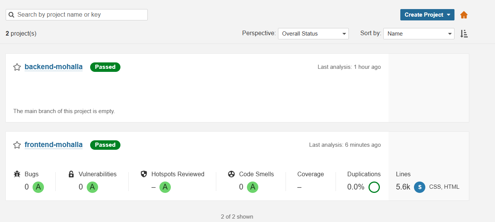
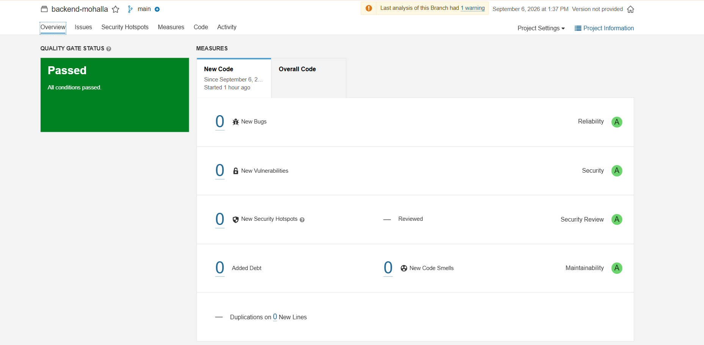
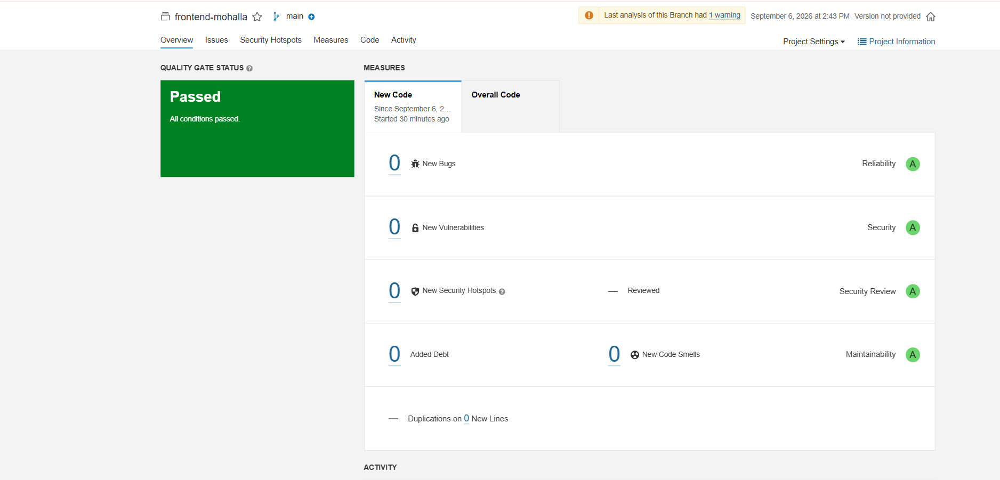
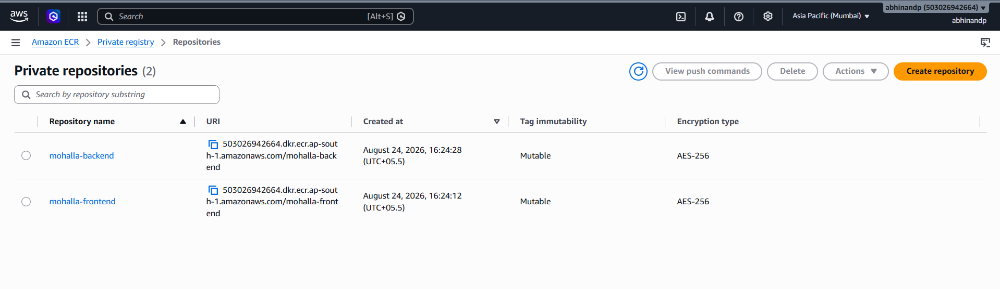
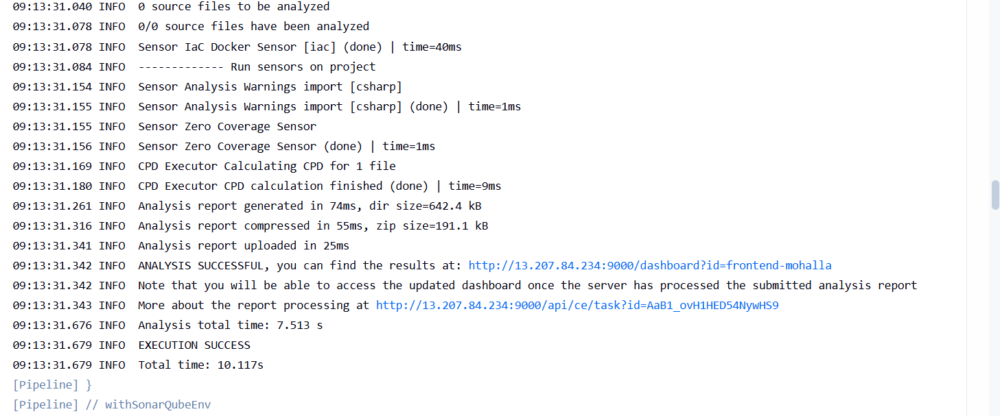

# Jenkins CI Pipeline with SonarQube, Security Scanning, Amazon ECR & GitOps Deployment

## Overview

This project implements a production-style CI pipeline for a MERN stack application using Jenkins, SonarQube, OWASP Dependency Check, Trivy, Docker, Amazon ECR, GitHub, Argo CD, and Amazon EKS.

The application consists of two independent services:

- Frontend (React)
- Backend (Node.js / Express)

Each service has its own Jenkins pipeline that performs automated code validation, security scanning, containerization, image publishing, and GitOps deployment updates.

The pipeline follows DevSecOps practices by enforcing code quality checks and vulnerability scanning before allowing an application image to be published and deployed.

---

# Architecture

```text
Developer
    │
    ▼
GitHub Repository
    │
    ▼
Jenkins Pipeline
    │
    ├── Source Code Checkout
    ├── SonarQube Analysis
    ├── Quality Gate Validation
    ├── OWASP Dependency Check
    ├── Trivy Filesystem Scan
    ├── Docker Image Build
    ├── Amazon ECR Push
    ├── Update Kubernetes Manifest
    └── Commit & Push Changes
    │
    ▼
GitHub Manifest Repository
    │
    ▼
Argo CD
    │
    ▼
Amazon EKS
```

---

# Technology Stack

| Technology | Purpose |
|------------|----------|
| Jenkins | Continuous Integration |
| GitHub | Source Code Management |
| SonarQube | Static Code Analysis |
| OWASP Dependency Check | Dependency Vulnerability Scanning |
| Trivy | Filesystem Security Scanning |
| Docker | Containerization |
| Amazon ECR | Container Registry |
| Argo CD | GitOps Continuous Delivery |
| Amazon EKS | Kubernetes Platform |
| Node.js | Backend Application |
| React | Frontend Application |
| AWS CLI | AWS Authentication & ECR Integration |

---

# CI Pipeline Workflow

## 1. Source Code Checkout

Jenkins automatically pulls the latest application code from GitHub.

```groovy
git branch: 'main',
url: '<repository-url>'
```

This ensures every build runs against the latest version of the application.

---

## 2. SonarQube Static Code Analysis

The pipeline performs automated source code analysis using SonarQube.

### Analysis Includes

- Bugs
- Vulnerabilities
- Security Hotspots
- Code Smells
- Reliability Rating
- Security Rating
- Maintainability Rating

### SonarQube Projects

| Service | Project Key |
|----------|-------------|
| Frontend | frontend-mohalla |
| Backend | backend-mohalla |

---

### SonarQube Projects Overview

Separate SonarQube projects are maintained for the frontend and backend services, enabling independent code quality analysis, reporting, and quality gate validation.




## 3. Quality Gate Validation

After code analysis Jenkins waits for the SonarQube Quality Gate result.

```groovy
waitForQualityGate abortPipeline: true
```

### Quality Gate Passed

```text
Pipeline Continues
Docker Build Starts
Deployment Workflow Continues
```

### Quality Gate Failed

```text
Pipeline Aborted
Docker Build Skipped
Image Push Blocked
Deployment Blocked
```

This guarantees that only validated code can move further through the pipeline.

### Backend Quality Gate

The backend application successfully passed all configured SonarQube Quality Gate requirements before continuing through the deployment workflow.



### Frontend Quality Gate

The frontend application successfully passed all configured SonarQube Quality Gate requirements before continuing through the deployment workflow.



---

## 4. OWASP Dependency Check

The pipeline performs Software Composition Analysis (SCA) using OWASP Dependency Check.

```groovy
dependencyCheck(
    odcInstallation: 'DP-Check',
    nvdCredentialsId: 'nvd-api-key',
    additionalArguments:
    '--scan . --disableYarnAudit --disableNodeAudit'
)
```

### Purpose

Dependency Check scans third-party libraries against the National Vulnerability Database (NVD) and identifies known vulnerabilities.

### Detection Areas

- Known CVEs
- Vulnerable Dependencies
- Security Risks in Open Source Packages

### Report Generation

```text
dependency-check-report.xml
```

Reports are automatically published within Jenkins.

---

## 5. Trivy Filesystem Security Scan

The pipeline performs filesystem scanning before image creation.

```bash
trivy fs .
```

### Trivy Checks

- Vulnerabilities
- Secrets
- Misconfigurations

### Output

```text
trivyfs.txt
```

This provides an additional security layer before containerization.

---

## 6. Docker Image Build

After all validation and security checks pass, Jenkins builds Docker images.

### Frontend

```bash
docker build -t mohalla-frontend .
```
### Frontend Environment Variable Management

The frontend application is built using **Vite**, which requires environment variables to be available during the build process.

Environment variables are injected into the Docker image during the CI pipeline using Docker build arguments and are embedded into the application when `npm run build` is executed.

```dockerfile
ARG VITE_API_URL
ENV VITE_API_URL=$VITE_API_URL
```

Because Vite uses build-time configuration, changes to frontend environment variables require a new application build and deployment.

### Update Workflow

```text
Update Environment Variable
            |
            ▼
    Jenkins CI Pipeline
            |
            ▼
      npm run build
            |
            ▼
    Build Docker Image
            |
            ▼
       Push to ECR
            |
            ▼
Update Deployment Manifest
            |
            ▼
         ArgoCD Sync
            |
            ▼
     Deploy to Amazon EKS
```

This approach ensures that frontend configuration changes are versioned, reproducible, and deployed through the same CI/CD and GitOps workflow as application code changes.
```
### Backend

```bash
docker build -t mohalla-backend .
```

---

## 7. Amazon ECR Integration

Validated images are pushed to Amazon Elastic Container Registry (ECR).

### Amazon ECR Repositories

Separate Amazon ECR repositories are maintained for frontend and backend container images. Jenkins pushes versioned Docker images to these repositories after all quality and security validation stages have successfully completed.



### Repositories

#### Frontend

```text
mohalla-frontend
```

#### Backend

```text
mohalla-backend
```

---

### ECR Authentication

```bash
aws ecr get-login-password \
| docker login \
--username AWS \
--password-stdin <ECR_URI>
```

---

### Image Versioning

Images are tagged using the Jenkins build number.

Example:

```text
mohalla-backend:42
mohalla-frontend:42
```

---

### Push Image

```bash
docker push <ECR_URI>/<repository>:<BUILD_NUMBER>
```

This creates immutable versioned images for deployment.

---

# GitOps Deployment Automation

After the image is successfully uploaded to ECR, Jenkins automatically updates the Kubernetes deployment manifests stored in a separate Git repository.

This repository serves as the deployment source for Argo CD.

---

## Generate New Image URI

```bash
IMAGE_URI=${AWS_ACCOUNT_ID}.dkr.ecr.${AWS_DEFAULT_REGION}.amazonaws.com/${AWS_ECR_REPO_NAME}:${BUILD_NUMBER}
```

Example:

```text
503026942664.dkr.ecr.ap-south-1.amazonaws.com/mohalla-backend:42
```

---

## Update Deployment Manifest

The deployment YAML is automatically updated with the new image tag.

```bash
sed -i -E \
"s|^[[:space:]]*image: .*| image: ${IMAGE_URI}|" \
backend-deployment.yaml
```

or

```bash
sed -i -E \
"s|^[[:space:]]*image: .*| image: ${IMAGE_URI}|" \
frontend-deployment.yaml
```

---

## Commit Changes

```bash
git add backend-deployment.yaml

git commit \
-m "Update backend image to build ${BUILD_NUMBER}"
```

---

## Push Changes

```bash
git push origin main
```

This automatically updates the desired deployment state stored in Git.

---

# GitOps Handoff to Argo CD

Jenkins is responsible for CI and artifact creation.

Argo CD is responsible for deployment synchronization.

```text
Jenkins
    │
    ▼
Amazon ECR
    │
    ▼
Manifest Repository
    │
    ▼
GitHub Commit
    │
    ▼
Argo CD
    │
    ▼
Amazon EKS
```

Once Jenkins updates the deployment manifests:

1. Argo CD detects the Git change.
2. The application enters an OutOfSync state.
3. Argo CD synchronizes the cluster.
4. Kubernetes deploys the new container image.
5. The application becomes Healthy and Synced.

No manual Kubernetes deployment commands are required.

---

# Deployment Verification

The following output demonstrates successful execution of the CI/CD workflow, including image build, image publication, GitOps manifest updates, and deployment automation.



---

---

# Security Controls Implemented

The pipeline includes multiple quality and security checkpoints.

| Control | Purpose |
|----------|----------|
| SonarQube Analysis | Static Code Quality Validation |
| Quality Gate | Blocks Poor Quality Code |
| OWASP Dependency Check | Detect Vulnerable Dependencies |
| Trivy Filesystem Scan | Detect Vulnerabilities & Misconfigurations |
| Versioned Docker Images | Immutable Releases |
| GitOps Deployment | Auditable Deployment Process |

---

# Project Deliverables

✅ Frontend Jenkins Pipeline

✅ Backend Jenkins Pipeline

✅ SonarQube Integration

✅ Automated Quality Gate Validation

✅ Pipeline Failure on Quality Gate Violation

✅ OWASP Dependency Vulnerability Scanning

✅ Trivy Filesystem Security Scanning

✅ Docker Image Build Automation

✅ Amazon ECR Integration

✅ Versioned Container Images

✅ Automated Kubernetes Manifest Updates

✅ GitOps Repository Integration

✅ Automated Git Commit & Push

✅ Argo CD Deployment Trigger

✅ Amazon EKS Deployment Automation

---

# Learning Outcomes

Through this implementation, I gained hands-on experience with:

- Jenkins Pipeline Development
- CI/CD Design
- DevSecOps Practices
- SonarQube Quality Gates
- Software Composition Analysis (SCA)
- OWASP Dependency Check
- Trivy Security Scanning
- Docker Containerization
- Amazon ECR
- GitOps Workflows
- Argo CD
- Kubernetes Deployments
- Amazon EKS
- Automated Release Management
- Production CI/CD Architecture

---

# Key Achievement

Built a complete DevSecOps CI → GitOps CD workflow where application code is validated through SonarQube Quality Gates, scanned for dependency vulnerabilities using OWASP Dependency Check, scanned for filesystem vulnerabilities using Trivy, containerized with Docker, published to Amazon ECR, propagated through Git-managed Kubernetes manifests, and automatically deployed to Amazon EKS using Argo CD.