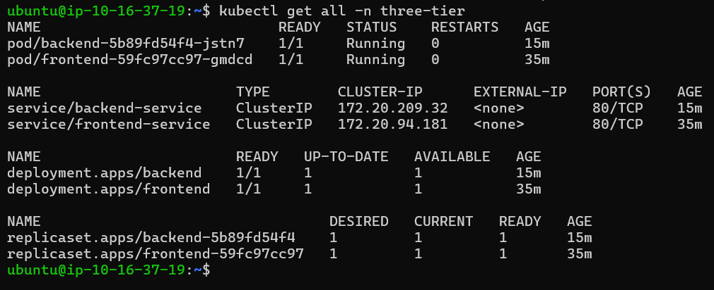
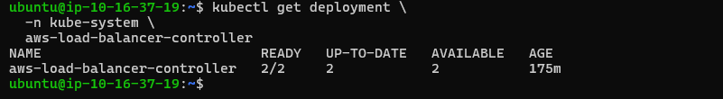
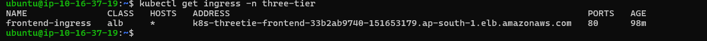
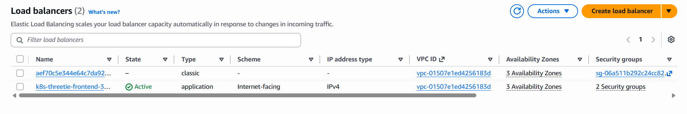
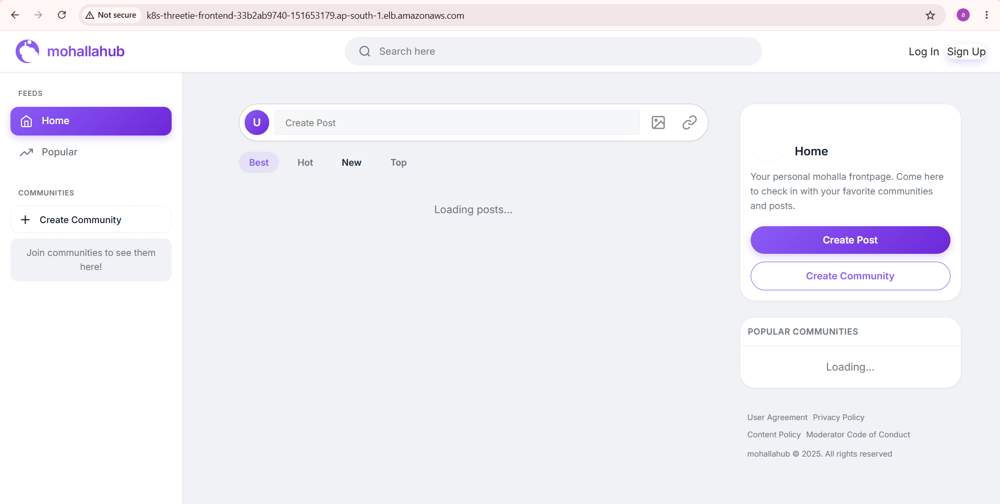
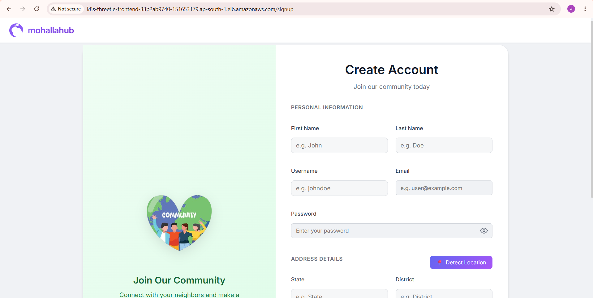

# Kubernetes Manifests

## 1. Overview

This directory contains the Kubernetes manifests used to deploy the **Mohallahub** application to Amazon EKS.

The application is deployed in the `three-tier` namespace and consists of:

* Backend Deployment and Service
* Frontend Deployment and Service
* Backend ConfigMap
* Kubernetes Ingress
* AWS Application Load Balancer integration
* MongoDB Atlas as the external database

The Kubernetes manifests are maintained separately from the application source code and are used by the deployment/GitOps workflow to define the desired Kubernetes state.

```text
kubernetes-manifest/

├── backend/
│   ├── backend-configmap.yaml
│   ├── backend-deployment.yaml
│   └── backend-service.yaml
│
└── frontend/
    ├── frontend-deployment.yaml
    ├── frontend-service.yaml
    └── ingress.yaml
```

---

# 2. Application Architecture

The application consists of a frontend, backend API, and an externally managed MongoDB Atlas database.

```text
                         Internet User
                              |
                              v
                    AWS ALB DNS Name
                              |
                              v
                Internet-facing AWS ALB
                              |
                              v
                    Kubernetes Ingress
                     frontend-ingress
                              |
                 +------------+------------+
                 |                         |
                "/"                    "/api/v1"
                 |                         |
                 v                         v
        frontend-service          backend-service
            ClusterIP                 ClusterIP
                 |                         |
                 v                         v
          Frontend Pod              Backend Pod
             :8080                     :8000
                                           |
                                           |
                                      Outbound traffic
                                           |
                                           v
                                      NAT Gateway
                                           |
                                           v
                                    MongoDB Atlas
```

The database is **not deployed as a MongoDB Pod inside EKS**.

Instead, MongoDB Atlas provides the managed database infrastructure. This removes the requirement for Kubernetes PersistentVolumes such as EBS volumes for the MongoDB database workload.

---

# 3. MongoDB Atlas Database

The backend application uses **MongoDB Atlas** as its database.

```text
Backend Pod
     |
     | MongoDB connection
     v
NAT Gateway
     |
     v
MongoDB Atlas
```

The Kubernetes cluster therefore does not contain:

```text
MongoDB Deployment
MongoDB Pod
MongoDB Service
PersistentVolume
PersistentVolumeClaim
```

for the application database.

Instead, database storage, replication, and database infrastructure are handled by MongoDB Atlas.

MongoDB Atlas supports application connectivity through public IP access lists, VPC peering, or private endpoints depending on the deployment architecture. ([MongoDB][1])

### NAT Gateway

In this project, the EKS workload uses the AWS VPC's outbound connectivity through the **NAT Gateway** to reach MongoDB Atlas.

The flow is:

```text
Backend Pod
     |
     v
Private Subnet
     |
     v
NAT Gateway
     |
     v
Internet / MongoDB Atlas endpoint
     |
     v
MongoDB Atlas
```

The NAT Gateway allows resources in private subnets to initiate outbound connections without directly exposing those resources to inbound internet traffic.

> **Note:** This project uses NAT-based outbound connectivity to Atlas. It should not be described as MongoDB Atlas VPC peering unless a dedicated Atlas peering connection was actually configured.

---

# 4. Backend Configuration

The backend uses a Kubernetes **ConfigMap** for application configuration.

Manifest:

```text
backend/backend-configmap.yaml
```

A ConfigMap allows configuration values to be stored separately from the container image and consumed by Kubernetes workloads. Kubernetes documents ConfigMaps as intended for non-confidential configuration data. ([Kubernetes][2])

The architecture is:

```text
backend-configmap.yaml
        |
        v
Backend Deployment
        |
        v
Backend Pod
        |
        v
Application environment
```

This allows environment-specific configuration to be supplied to the backend without modifying the application source code.

### Important security consideration

A ConfigMap is **not a secret store**. Kubernetes explicitly notes that ConfigMaps do not provide secrecy or encryption. ([Kubernetes][2])

Therefore:

```text
Non-sensitive configuration
        ↓
ConfigMap

Passwords / API keys / JWT secrets
        ↓
Kubernetes Secret
        or
AWS Secrets Manager
```

Any credentials currently present in the project configuration should be rotated and migrated to a proper secret-management solution before production use.

---

# 5. Backend Deployment

The backend is deployed using:

```text
backend/backend-deployment.yaml
```

The corresponding Kubernetes Service is:

```text
backend/backend-service.yaml
```

The architecture is:

```text
backend Deployment
       |
       v
Backend Pod
       |
       v
backend-service
       |
       v
ClusterIP
```

The backend container listens on port:

```text
8000
```

The Kubernetes Service exposes it internally on:

```text
80 → 8000
```

The Service is a `ClusterIP`.

A ClusterIP Service is intended for cluster-internal access and can be reached by other workloads inside the Kubernetes cluster. ([Kubernetes][3])

---

# 6. Backend Health Checks

The backend Deployment contains Kubernetes health probes.

```text
Startup
/api/v1/startup

Readiness
/api/v1/ready

Liveness
/api/v1/health
```

These probes allow Kubernetes to determine whether the application has started, whether it is ready to receive traffic, and whether it remains healthy.

The readiness probe is particularly important because traffic should only be sent to a backend Pod after it has successfully become ready.

---

# 7. Frontend Architecture

The frontend is a Vite-based application.

The frontend source code is first built using Node/npm.

The general build process is:

```text
Frontend Source Code
        |
        v
npm install
        |
        v
npm run build
        |
        v
Vite production build
        |
        v
Static files
        |
        v
Nginx container
        |
        v
Frontend Pod
```

The resulting Vite build is placed into the Nginx container, which serves the generated static files.

This allows Nginx to act as the web server for the production frontend.

---

# 8. Frontend Environment Variables

An important part of the frontend build is that Vite environment variables are handled **at build time**.

The CI pipeline passes the required environment values when the Docker image is built.

Conceptually:

```text
Jenkins
   |
   | Docker build arguments
   v
Dockerfile
   |
   | VITE_* variables
   v
npm run build
   |
   v
Vite generates static JavaScript
   |
   v
Nginx image
```

For example, the CI pipeline passes the backend API URL during the Docker build:

```text
VITE_BACKEND_API_URL
```

The value becomes part of the generated frontend bundle during:

```text
npm run build
```

Therefore, changing the frontend environment variable after the image has already been built does **not** automatically change the value inside the compiled JavaScript.

A new frontend image must be built when a build-time `VITE_*` value changes.

This is an important distinction from the backend ConfigMap:

```text
Backend
ConfigMap
    ↓
Runtime configuration


Frontend
Docker build argument
    ↓
Vite build
    ↓
Static JavaScript
    ↓
Runtime value is already baked into the bundle
```

---

# 9. Frontend Deployment

The frontend is deployed using:

```text
frontend/frontend-deployment.yaml
```

The corresponding Service is:

```text
frontend/frontend-service.yaml
```

The architecture is:

```text
frontend Deployment
       |
       v
Frontend Pod
       |
       v
frontend-service
       |
       v
ClusterIP
```

The frontend container listens on:

```text
8080
```

The Kubernetes Service exposes:

```text
80 → 8080
```

The frontend Service is also a `ClusterIP`.

---

# 10. Ingress and AWS ALB

The frontend Ingress is defined in:

```text
frontend/ingress.yaml
```

The Ingress uses the AWS Load Balancer Controller:

```yaml
ingressClassName: alb
```

and configures an internet-facing ALB:

```yaml
alb.ingress.kubernetes.io/scheme: internet-facing
```

The project also uses:

```yaml
alb.ingress.kubernetes.io/target-type: ip
```

This allows the AWS load balancer target groups to use Kubernetes Pod IP addresses.

The resulting architecture is:

```text
Internet
   |
   v
AWS Application Load Balancer
   |
   v
AWS Load Balancer Controller
   |
   v
Kubernetes Ingress
   |
   +----------------------+
   |                      |
   v                      v
frontend-service     backend-service
   |                      |
   v                      v
Frontend Pod          Backend Pod
```

---

# 11. Ingress Routing

The Ingress provides two path-based routes:

```text
/          → frontend-service:80

/api/v1    → backend-service:80
```

Both routes use `Prefix` matching.

Therefore:

```text
http://<ALB-DNS>/
```

is routed to the frontend.

Requests such as:

```text
http://<ALB-DNS>/api/v1/...
```

are routed to the backend.

The Ingress does **not** define a custom hostname.

Therefore, there is no custom domain such as:

```text
app.example.com
```

configured in the Ingress.

The application is accessed using the DNS hostname automatically assigned to the AWS ALB.

---

# 12. AWS ALB DNS

When the Ingress is processed by the AWS Load Balancer Controller, an internet-facing Application Load Balancer is created.

AWS provides an automatically generated DNS name similar to:

```text
k8s-threetie-frontend-xxxxxxxx.ap-south-1.elb.amazonaws.com
```

No Route 53 custom DNS mapping was configured for this project.

Therefore:

```text
User
 |
 v
ALB-generated DNS name
 |
 v
AWS ALB
 |
 v
Ingress
```

The application was successfully accessed through this ALB DNS name using a web browser.

---

# 14. Verification

### Check Pods

```bash
kubectl get pods -n three-tier -o wide
```

### Check Deployments

```bash
kubectl get deployments -n three-tier
```

### Check Services

```bash
kubectl get svc -n three-tier
```

### Check Ingress

```bash
kubectl get ingress -n three-tier
```

### Check Target Group Bindings

```bash
kubectl get targetgroupbindings -n three-tier
```

### Check all resources

```bash
kubectl get all -n three-tier
```

### Check detailed Ingress information

```bash
kubectl describe ingress frontend-ingress -n three-tier
```

### Check backend configuration

```bash
kubectl get configmap -n three-tier
```

---

# 15. Deployment Verification

The captured Kubernetes output demonstrated that the application was successfully deployed.

The observed resources included:

```text
Backend Pod       → Running
Frontend Pod      → Running

backend-service   → ClusterIP
frontend-service  → ClusterIP

backend Deployment  → 1/1 Available
frontend Deployment → 1/1 Available

Ingress           → AWS ALB DNS address
```

The target group bindings also showed:

```text
backend-service  → target-type: ip
frontend-service → target-type: ip
```

This confirms that the AWS Load Balancer Controller was integrating the Kubernetes Services with the AWS load balancer.

### Kubernetes Resources



### AWS Load Balancer Controller



### Kubernetes Ingress



### AWS Application Load Balancer



---

# 16. Application Verification

The final application was accessed through the automatically generated AWS ALB DNS name.

### Mohallahub Home Page



### Mohallahub Signup Page



These screenshots demonstrate that the Kubernetes deployment was not only created successfully, but that the application was reachable externally through the AWS load-balancing layer.

---

# 17. Complete Traffic Flow

The complete application request flow is:

```text
                    Internet User
                         |
                         v
              AWS ALB DNS Name
                         |
                         v
              Internet-facing ALB
                         |
                         v
              Kubernetes Ingress
                 frontend-ingress
                         |
              +----------+----------+
              |                     |
          "/" route             "/api/v1"
              |                     |
              v                     v
     frontend-service        backend-service
         ClusterIP               ClusterIP
              |                     |
              v                     v
       Frontend Pod             Backend Pod
          :8080                   :8000
                                    |
                                    v
                               NAT Gateway
                                    |
                                    v
                              MongoDB Atlas
```

The important distinction is that the ALB provides **external access to the application**, while the Kubernetes Services provide **internal service connectivity**.

The database is external to Kubernetes and is accessed by the backend through outbound network connectivity.

---

# 19. Current Limitations

The current implementation has the following limitations:
* The application uses the **AWS-generated ALB DNS name** rather than a custom Route 53 domain.
* The Ingress currently uses **HTTP rather than HTTPS/TLS**.
* Frontend `VITE_*` environment variables are supplied during the Docker build and therefore are **baked into the static frontend bundle**.
* A frontend image rebuild is required through the a ci pipeline we configured when build-time Vite environment values change 
* MongoDB is managed externally through MongoDB Atlas rather than through Kubernetes persistent storage.
* Database connectivity depends on outbound network connectivity through the AWS NAT Gateway.
* The EKS cluster has since been stopped; the screenshots represent the deployment state while the cluster was running.

---

# 20. Summary

The Kubernetes manifests form the application deployment layer of the project.

```text
                 Git / CI Pipeline
                       |
                       v
                 Docker Images
                       |
                       v
                      ECR
                       |
                       v
                   Argo cd
                       |
                       v
                  Kubernetes
                     EKS
                       |
          +------------+------------+
          |                         |
          v                         v
     Frontend Pod              Backend Pod
       Nginx                      API
          |                         |
          v                         v
 frontend-service             backend-service
          |                         |
          +------------+------------+
                       |
                       v
                  Kubernetes
                    Ingress
                       |
                       v
                 AWS ALB
                       |
                       v
                ALB DNS Name
                       |
                       v
                   Internet


Backend Pod
     |
     v
 NAT Gateway
     |
     v
MongoDB Atlas
```

