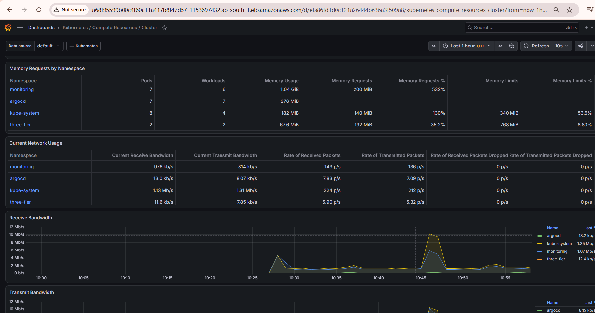
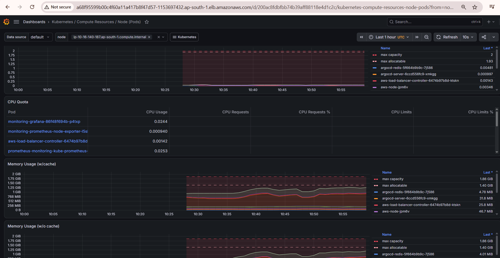
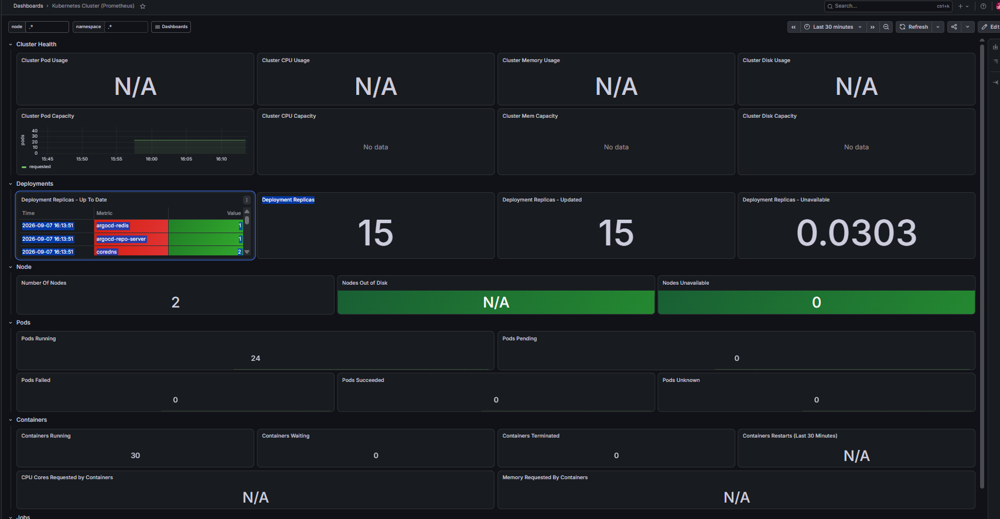

# Monitoring & Observability

## Overview

A monitoring and observability solution was implemented for the Kubernetes workloads running on Amazon EKS.

The monitoring stack was deployed in a dedicated `monitoring` namespace and provides visibility into cluster, node, namespace, pod, and control-plane metrics through Grafana dashboards backed by Prometheus.

### Monitoring Architecture

```text id="s4tnpq"
Kubernetes Cluster
        │
        │ Metrics
        ▼
Prometheus
        │
        │ PromQL Queries
        ▼
Grafana Dashboards
        │
        ▼
Cluster / Node / Namespace / Pod Metrics

Prometheus
        │
        ▼
Alertmanager
        │
        ▼
Alert Notifications
```

Prometheus collects and stores metrics as time-series data, while Grafana visualizes those metrics through dashboards and charts.

---

## Monitoring Stack Components

- **Prometheus** – Collects and stores Kubernetes metrics.
- **Grafana** – Visualizes metrics through dashboards.
- **Alertmanager** – Manages and routes alerts.
- **Prometheus Operator** – Manages Prometheus-related Kubernetes resources.
- **kube-state-metrics** – Exposes Kubernetes object and state metrics.
- **Node Exporter** – Collects node-level metrics.

---
## Monitoring Stack Installation

The monitoring platform was deployed using the Prometheus Community **kube-prometheus-stack** Helm chart.

### Prerequisites

* Amazon EKS Cluster
* kubectl
* Helm

### Add Helm Repository

```bash
helm repo add prometheus-community https://prometheus-community.github.io/helm-charts
helm repo update
```

### Create Monitoring Namespace

```bash
kubectl create namespace monitoring
```

### Install Monitoring Stack

```bash
helm install monitoring prometheus-community/kube-prometheus-stack \
  --namespace monitoring
```

This deployment installs:

* Prometheus
* Grafana
* Alertmanager
* Prometheus Operator
* kube-state-metrics
* Node Exporter
* Preconfigured Kubernetes dashboards

---

## Deployment Verification

Verify monitoring components:

```bash
kubectl get pods -n monitoring
```

Example monitoring pods:

```text id="35c5lt"
alertmanager-monitoring-kube-prometheus-alertmanager
monitoring-grafana
monitoring-kube-prometheus-operator
monitoring-kube-state-metrics
monitoring-prometheus-node-exporter
prometheus-monitoring-kube-prometheus-prometheus
```

All monitoring components were successfully deployed and running.

---

## Prometheus Data Source

## Grafana Data Source Configuration

The Grafana instance was automatically configured with Prometheus as the default metrics data source through the kube-prometheus-stack deployment.

This allows Grafana dashboards to query Kubernetes metrics directly from Prometheus without additional manual configuration.

### Prometheus Data Source


The screenshot shows the provisioned Prometheus data source available within Grafana and configured as the primary source for cluster monitoring dashboards.

---

Grafana was configured to use Prometheus as its primary metrics data source.

Monitoring services included:

```text id="2b96md"
monitoring-grafana
monitoring-kube-prometheus-alertmanager
monitoring-kube-prometheus-operator
monitoring-kube-prometheus-prometheus
monitoring-kube-state-metrics
monitoring-prometheus-node-exporter
```

The Prometheus data source was successfully provisioned and available within Grafana.

---


## Cluster-Level Monitoring

## Cluster Resource Monitoring Dashboard

Grafana dashboards provide visibility into overall Kubernetes cluster resource utilization and namespace-level resource consumption.

### Cluster Resource Dashboard


The dashboard displays:

- CPU Utilization
- CPU Requests & Limits
- Memory Utilization
- Memory Requests & Limits
- Namespace Resource Consumption
- Workload Distribution

This provides an overall view of cluster health and resource allocation across namespaces.

Grafana dashboards provided visibility into cluster-wide resource utilization, including:

* CPU Utilization
* CPU Requests & Limits
* Memory Utilization
* Memory Requests & Limits
* Namespace Resource Consumption

Monitored namespaces included:

```text id="awfq0p"
monitoring
argocd
kube-system
three-tier
```

---

## Namespace Monitoring

## Namespace Resource Monitoring

Grafana dashboards provide detailed visibility into resource usage across Kubernetes namespaces.

### Namespace Metrics Dashboard



The dashboard displays:

- Namespace CPU Usage
- CPU Requests & Limits
- Memory Usage
- Memory Requests & Limits
- Network Throughput
- Workload Distribution

Observed namespaces include:

- monitoring
- argocd
- kube-system
- three-tier

This enables comparison of resource consumption between platform services and application workloads.

---

Namespace dashboards provided visibility into:

* Pod Count
* Workload Count
* CPU Usage
* CPU Requests & Limits
* Memory Usage
* Memory Requests & Limits
* Network Throughput
* Packet Rates
* Dropped Packets

This enabled comparison between application and system namespaces.

---

## Pod-Level Monitoring

## Pod-Level Resource Monitoring

Grafana dashboards provide workload-level observability by exposing metrics for individual pods running within the cluster.

### Pod Monitoring Dashboard



The dashboard displays:

- Pod CPU Usage
- CPU Quota
- CPU Requests
- CPU Limits
- Memory Usage
- Container Resource Consumption

This level of observability helps identify resource-intensive workloads and verify application performance within Kubernetes.

---

Pod dashboards provided detailed metrics for individual workloads, including:

* CPU Usage
* CPU Throttling
* CPU Quota
* Memory Usage
* Container Resource Consumption

This demonstrated observability at the workload level rather than only at the cluster level.

---

## Kubernetes API Server Monitoring

Dedicated dashboards provided insight into Kubernetes control-plane health and performance.

Available metrics included:

* Work Queue Add Rate
* Work Queue Depth
* Work Queue Latency
* CPU Usage
* Memory Usage
* Goroutines

Service-level metrics included:

* Availability
* Error Budget
* Request Rate
* Error Rate
* Request Duration

---

## Cluster Health Verification

## Cluster Health Dashboard

Grafana provides a consolidated health dashboard showing deployment, node, pod, and container status across the cluster.

### Cluster Health Overview



The dashboard provides visibility into:

- Deployment Replicas
- Updated Replicas
- Unavailable Replicas
- Node Availability
- Running Pods
- Pending Pods
- Failed Pods
- Container Status

At the time of validation:

- 2 Nodes Available
- 24 Running Pods
- 0 Pending Pods
- 0 Failed Pods
- 30 Running Containers

These metrics confirmed that the EKS cluster and deployed workloads were operating normally.

---

Cluster health dashboards provided visibility into:

### Deployments

* Deployment Replicas
* Updated Replicas
* Unavailable Replicas

### Nodes

* Number of Nodes
* Nodes Out of Disk
* Nodes Unavailable

### Pods

* Running Pods
* Pending Pods
* Failed Pods
* Succeeded Pods

### Containers

* Running Containers
* Waiting Containers
* Terminated Containers
* Restart Counts

Example observed values:

```text id="fcrlws"
Number of Nodes: 2
Nodes Unavailable: 0
Pods Running: 24
Pods Pending: 0
Pods Failed: 0
Pods Unknown: 0
Containers Running: 30
Containers Waiting: 0
Containers Terminated: 0
```

These metrics indicated that the EKS cluster was operating normally at the time monitoring verification was performed.
